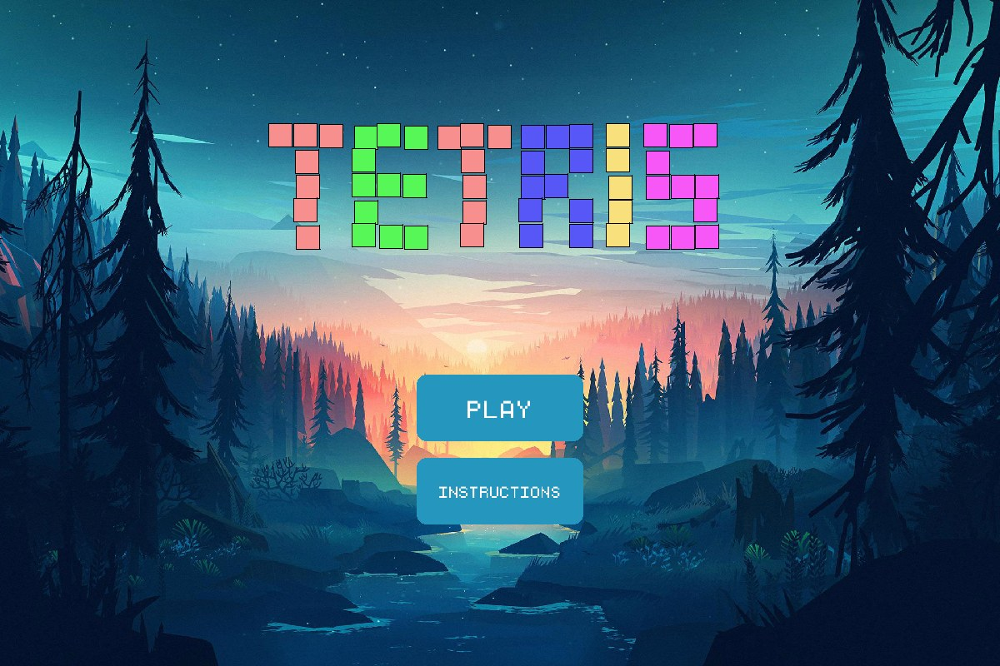
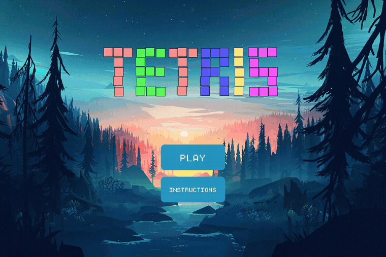
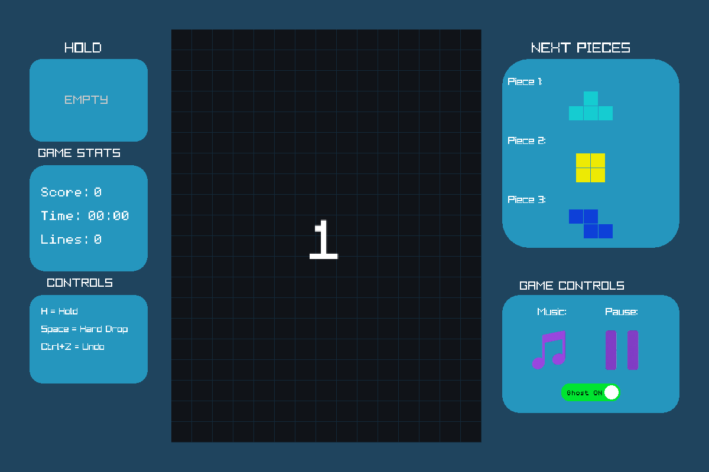

<div align="center">

# 🎮 Blockfall

### A Tetris-style game built in C++ with custom data structures

<p>
  <strong>Data Structures &nbsp;•&nbsp; Game Development &nbsp;•&nbsp; Raylib</strong>
</p>


<p>
  <a href="#-preview">Preview</a> ·
  <a href="#-features">Features</a> ·
  <a href="#-data-structures">Data Structures</a> ·
  <a href="#️-build--run">Build & Run</a>
</p>

</div>

---

## 🖼️ Preview

<p align="center">
  
</p>

<p align="center">
  <sub>The welcome screen — the falling "TETRIS" letters are individually simulated blocks, not an image.</sub>
</p>

<p align="center">
  
</p>

<p align="center">
  <sub>Real gameplay capture: movement, rotation, hard drop, next-piece preview, and the ghost-piece landing guide.</sub>
</p>

---

## 📌 Overview

**Blockfall** is a Tetris-style desktop game developed in **C++** using **Raylib**.

The project was designed to demonstrate how fundamental **data structures can be implemented from scratch and integrated into a complete interactive application**.

Instead of treating data structures as isolated exercises, each structure has a specific role within the game:

* A **linked list** manages the piece bag and game-board rows.
* A **queue** manages upcoming pieces.
* A **stack** stores previous game states for undo functionality.
* An **AVL tree** organises leaderboard scores.
* A dedicated **PieceQueue** combines multiple structures to manage piece generation.

This makes the project both a playable game and a practical demonstration of data-structure usage.

---

## 👥 Team & Project Context

**Blockfall** originated as a **semester group project for Data Structures and Algorithms**. The original project was developed collaboratively in the repository **Aiman-Misbah/DSA-Project** before being reorganised and continued under this repository.

| Team Member | Main Contributions |
| ----------- | ------------------ |
| **Aiman** | AVL tree and leaderboard implementation, along with early game and application integration |
| **Maryam** | Queue, PieceQueue, UndoStack, and early game-controller/game integration |
| **Umaima** | Board, LinkedList, pieces, positions, UI components, game integration, and later project restructuring and build/documentation work |

---

## 🎮 Controls

<p align="center">
  
</p>

| Key | Action |
|---|---|
| `←` / `→` | Move piece left / right |
| `↓` | Soft drop |
| `↑` | Rotate |
| `Space` | Hard drop |
| `H` | Hold piece |
| `Ctrl + Z` | Undo |

The in-game HUD (above) shows the **Hold slot**, live **score / time / lines**, the next **3 upcoming pieces**, and toggles for music and pause — plus the ghost-piece outline that previews where the current piece will land.

---

## ✨ Features

* 🎮 Tetris-style gameplay on a **15 × 20** board
* 🧩 Seven standard Tetris piece types
* 🔄 Piece movement and rotation
* 💥 Collision detection
* 🧱 Completed-row detection and clearing, with **SINGLE! / DOUBLE!! / TRIPLE!!! / TETRIS!!!!** on-screen messages
* 🏅 Classic scoring: 100 / 200 / 500 / 800 points for 1–4 lines, +100 per extra line beyond that
* 👀 Upcoming-piece preview (3 pieces deep)
* 🎲 Random piece generation using a piece bag
* 👻 Ghost-piece landing preview (toggleable)
* ↩️ Undo functionality through saved game states
* 🏆 AVL-tree-based score leaderboard
* 🔊 Background music and sound effects, with an in-game mute toggle
* 🖥️ Raylib-based graphical interface
* 📦 Modular source and header organisation

---

## 🧠 Data Structures

The core of the project is its custom data-structure implementation.

### 1. Linked List — Piece Bag

The piece bag is implemented using a custom **singly linked list**.

```text
LinkedList
    │
    ▼
┌─────────────┐
│ Piece       │
│ next ───────┼──────► Piece
└─────────────┘          │
                         ▼
                       Piece
                         │
                         ▼
                        ...
```

The `LinkedList` implementation provides operations for:

* Adding pieces
* Retrieving pieces by index
* Removing pieces
* Checking the current size
* Clearing the list

The list is used by `PieceQueue` as the **piece bag** from which new pieces are selected.

---

### 2. Queue — Upcoming Pieces

A custom **FIFO queue** manages pieces waiting to enter the game, with a default capacity of **five pieces**:

| Operation   | Purpose                                      |
| ----------- | --------------------------------------------- |
| `enqueue()` | Add a piece to the rear                      |
| `dequeue()` | Remove the piece at the front                |
| `peek()`    | Inspect the front piece                      |
| `isEmpty()` | Check whether the queue is empty             |
| `isFull()`  | Check whether the queue has reached capacity |
| `getSize()` | Return the current number of pieces          |
| `clear()`   | Empty the queue                              |

---

### 3. PieceQueue — Piece Generation

`PieceQueue` acts as the layer connecting the **piece bag** and the **upcoming-piece queue**.

```text
                 PieceQueue
                     │
             ┌───────┴───────┐
             ▼               ▼
          Queue          LinkedList
             │               │
             ▼               ▼
       Next pieces        Piece bag
```

It fills the initial queue, randomly selects pieces from the bag, supplies the next piece to the game, provides upcoming pieces for the interface, and saves/restores queue state for undo.

---

### 4. Linked List — Game Board

The game board uses a separate linked-list structure to represent its rows. Each `RowNode` contains an array of **15 cells** and a pointer to the next row.

```text
Board
 │
 ▼
Row 0 ──► Row 1 ──► Row 2 ──► ... ──► Row 19
 │          │          │                 │
15 cells  15 cells   15 cells          15 cells
```

The board is **20 rows × 15 columns**, and supports adding/accessing rows, detecting completed rows, clearing rows, checking cell occupancy, detecting collisions, and saving/restoring board state.

---

### 5. Stack — Undo System

Previous game states are pushed onto a custom **LIFO stack** as the game progresses.

```text
        UndoStack
           │
           ▼
     ┌───────────┐
     │ State 3   │  ← most recent
     ├───────────┤
     │ State 2   │
     ├───────────┤
     │ State 1   │
     └───────────┘
```

Pressing `Ctrl+Z` restores the most recently saved state — board, score, current piece, and upcoming pieces — rather than reversing just one movement.

---

### 6. AVL Tree — Leaderboard

The leaderboard uses a custom **self-balancing AVL tree** to keep scores ordered.

```text
              Score
             /     \
          Score    Score
           /          \
        Score        Score
```

Supports inserting scores, maintaining tree balance via rotations, retrieving high scores, and clearing the tree.

---

## 🏗️ Game Architecture

```text
                         ┌──────────────┐
                         │   main.cpp   │
                         └──────┬───────┘
                                │
              ┌─────────────────┼─────────────────┐
              │                 │                 │
              ▼                 ▼                 ▼
          Game Logic       Data Structures     UI / Screens
              │                 │                 │
              │          ┌──────┼──────┐          │
              │          │      │      │          │
              │          ▼      ▼      ▼          │
              │       Linked  Queue  Stack        │
              │       List           /Undo        │
              │          │                         │
              │          ▼                         │
              │       AVL Tree                     │
              │          │                         │
              └──────────┼─────────────────────────┘
                         ▼
                    Raylib Layer
```

| Directory          | Responsibility                                        |
| ------------------ | ----------------------------------------------------- |
| `game/`            | Core Tetris gameplay and piece logic                  |
| `data_structures/` | Custom DSA implementations                            |
| `leaderboard/`     | Score and leaderboard management                      |
| `ui/`              | Screens, interface elements, colours and presentation |
| `assets/`          | Images, audio and fonts                               |

---

## 📁 Project Structure

```text
Blockfall/
│
├── assets/
│   ├── audio/        (music.mp3, rotate.mp3, clear.mp3)
│   ├── fonts/         (monogram.ttf)
│   └── images/        (wallpaper, music/pause icons)
│
├── docs/
│   ├── screenshots/
│   └── demo/
│
├── include/
│   ├── data_structures/
│   │   ├── LinkedList.h
│   │   ├── PieceQueue.h
│   │   ├── Queue.h
│   │   ├── ScoreAVL.h
│   │   └── UndoStack.h
│   ├── game/
│   │   ├── Board.h
│   │   ├── Game.h
│   │   ├── Piece.h
│   │   ├── Pieces.h
│   │   └── Position.h
│   ├── leaderboard/
│   │   └── Leaderboard.h
│   └── ui/
│       ├── Colours.h
│       ├── Manager.h
│       └── WelcomeScreen.h
│
├── src/
│   ├── data_structures/
│   ├── game/
│   ├── leaderboard/
│   ├── ui/
│   └── main.cpp
│
├── .gitignore
├── Makefile
└── README.md
```

---

## 🖥️ Technologies

| Technology             | Role                                          |
| ---------------------- | --------------------------------------------- |
| **C++17**              | Application and data-structure implementation |
| **Raylib 5.5**         | Graphics, audio, input and window management  |
| **MinGW-w64 / GCC**    | C++ compilation                               |
| **GNU Make**           | Build automation                              |
| **Visual Studio Code** | Development environment                       |

---

## ⚙️ Build & Run

### Requirements

* Windows
* C++17-compatible compiler
* MinGW-w64 / GCC
* GNU Make
* Raylib 5.5

### Build

```powershell
mingw32-make
```

### Run

```powershell
.\main.exe
```

### Clean

```powershell
mingw32-make clean
```

The project uses the included `Makefile` to compile all source files with **C++17** and link them against Raylib and the required Windows libraries.

> **Note:** the Makefile targets Windows (MinGW + vcpkg), but the source itself is portable standard C++ — it compiles and runs cleanly on Linux too against a native Raylib 5.5 build, with no Windows-specific code paths. The screenshots and GIF above were captured from a Linux build of this exact source.

---

## 🔍 Why Data Structures Matter Here

| Structure               | Game System      | Why It Fits                                  |
| ----------------------- | ---------------- | --------------------------------------------- |
| **Linked List**         | Piece bag        | Dynamic sequence of available pieces         |
| **Linked List**         | Board rows       | Sequential row representation                |
| **Queue**               | Upcoming pieces  | FIFO ordering                                |
| **Stack**               | Undo             | Most recent state must be restored first     |
| **AVL Tree**            | Leaderboard      | Maintains ordered, balanced score data       |
| **Combined structures** | Piece generation | Coordinates the piece bag and upcoming queue |

This integration is the main focus of the project: **applying data-structure concepts to real game functionality.**

---

<div align="center">

### 🎮 Built as a practical application of Data Structures & Algorithms

**C++17 • Raylib • Custom Data Structures**

</div>
