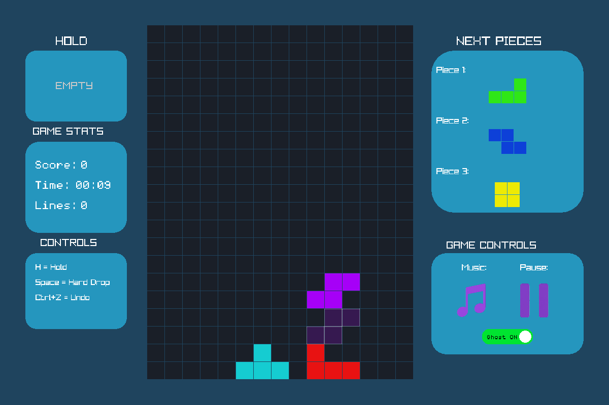
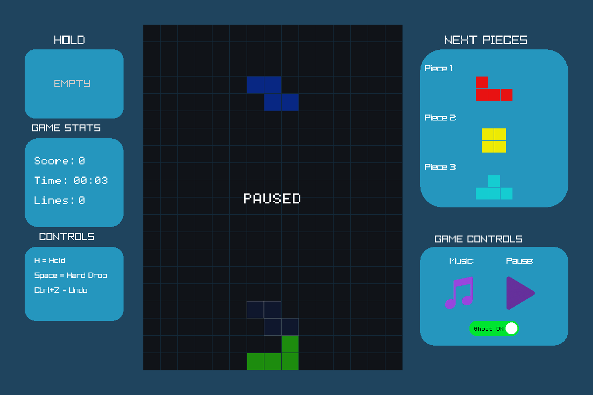
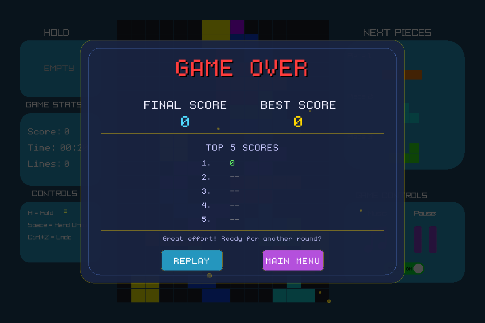

<div align="center">

# 🎮 BLOCKFALL

### Tetris-style game built in C++ with custom data structures


<p><sub>Real gameplay capture: movement, rotation, hard drop, next-piece preview, and the ghost-piece landing guide.</sub></p>


<p>
  <a href="#️-gameplay">Gameplay</a> ·
  <a href="#-data-structures">Data Structures</a> ·
  <a href="#️-architecture">Architecture</a> ·
  <a href="#-gameplay-flow">Flow</a> ·
  <a href="#-project-at-a-glance">At a Glance</a> ·
  <a href="#️-build--run">Build & Run</a>
</p>

</div>

---

**Blockfall** is a Tetris-style desktop game built in **C++17** with **Raylib**, developed as a semester project for **Data Structures and Algorithms**. Instead of treating data structures as isolated exercises, each one has a real job inside the game — a queue feeds upcoming pieces, a stack powers undo, an AVL tree keeps the leaderboard sorted, and linked lists drive both the piece bag and the board itself.

---

## 🕹️ Gameplay

<table>
<tr>
<td align="center" width="50%">

<br><sub><b>Welcome screen</b> — falling-letter title animation</sub>
</td>
<td align="center" width="50%">

<br><sub><b>Active gameplay</b> — board, HUD, next-piece preview</sub>
</td>
</tr>
<tr>
<td align="center" width="50%">

<br><sub><b>Paused</b> — board dims, pause icon flips to play</sub>
</td>
<td align="center" width="50%">

<br><sub><b>Game over</b> — final score + AVL-backed Top 5 leaderboard</sub>
</td>
</tr>
</table>

### Controls

```text
              ↑
           Rotate

   ←        ↓        →
  Move   Soft Drop   Move

        SPACE = Hard Drop
          H = Hold
       CTRL+Z = Undo
```

| Key | Action |
|---|---|
| `←` / `→` | Move piece left / right |
| `↓` | Soft drop |
| `↑` | Rotate |
| `Space` | Hard drop |
| `H` | Hold piece |
| `Ctrl + Z` | Undo |

---

## ✨ Features

* 🎮 Tetris-style gameplay on a **15 × 20** board, 7 standard piece types
* 🔄 Movement, rotation, and collision detection
* 🧱 Line clearing with on-screen **SINGLE! / DOUBLE!! / TRIPLE!!! / TETRIS!!!!** messages
* 🏅 Classic scoring — 100 / 200 / 500 / 800 points for 1–4 lines, +100 per extra line
* 👀 Next-piece preview, 3 pieces deep
* 👻 Toggleable ghost-piece landing guide
* ↩️ Undo via saved game-state snapshots
* 🏆 AVL-tree-backed score leaderboard (Top 5)
* 🔊 Background music, rotate/clear sound effects, in-game mute toggle
* ⏸️ Pause/resume

---

## 🧩 Data Structures

This is a DSA project first — every structure below is doing real work, not sitting there as an exercise.

```text
                          BLOCKFALL
                              │
          ┌──────────┬────────┼────────┬──────────┐
          ▼          ▼        ▼        ▼          ▼
       Queue      UndoStack  ScoreAVL  LinkedList  LinkedList
          │          │          │          │          │
     Upcoming      Undo      Leaderboard  Piece      Board
      Pieces      States       Scores      Bag        Rows
          │
          ▼
      PieceQueue
   (combines Queue +
    LinkedList bag to
    generate pieces)
```

| Structure | Used for | Why it fits |
|---|---|---|
| **Linked List** | Piece bag | Dynamic sequence pieces are drawn from |
| **Linked List** | Board rows | Each row is a node holding 15 cells |
| **Queue** | Upcoming pieces | FIFO — pieces enter play in the order they're drawn |
| **Stack** | Undo | Most recent state must come back first (LIFO) |
| **AVL Tree** | Leaderboard | Keeps scores ordered and balanced on every insert |


## 🏗️ Architecture

```text
                       main.cpp
                          │
            ┌─────────────┼─────────────┐
            ▼             ▼             ▼
        WelcomeScreen    Game         Manager
                          │           (UI/HUD)
            ┌─────────────┼─────────────┐
            ▼             ▼             ▼
          Board        PieceQueue    UndoStack
     (LinkedList of      │
         rows)    ┌──────┴──────┐
                   ▼             ▼
                 Queue       LinkedList
               (upcoming)    (piece bag)

                     Game
                      │
                      ▼
                  Leaderboard
                      │
                      ▼
                  ScoreAVL
```

| Directory | Responsibility |
|---|---|
| `game/` | Core Tetris gameplay and piece logic |
| `data_structures/` | Custom DSA implementations |
| `leaderboard/` | Score and leaderboard management |
| `ui/` | Screens, HUD, colours, presentation |
| `assets/` | Images, audio, fonts |

---

## 🔄 Gameplay Flow

```text
         Start Game
              │
              ▼
       Generate Piece ◄─────────────┐
              │                     │
              ▼                     │
         PieceQueue                 │
         (bag + queue)              │
              │                     │
              ▼                     │
       Player Movement              │
      (move / rotate / drop)        │
              │                     │
              ▼                     │
       Collision Check              │
              │                     │
              ▼                     │
         Piece Locks                │
              │                     │
              ▼                     │
      Row(s) complete? ─── No ──────┘
              │
             Yes
              │
              ▼
     Clear row(s) + Score
              │
              ▼
     Can next piece spawn? ── Yes ──► (loop back to Generate Piece)
              │
              No
              │
              ▼
          GAME OVER
              │
              ▼
    AVL Insert → Leaderboard
```

---

## 📊 Project at a Glance

| Area | Implementation |
|---|---|
| Language | C++17 |
| Graphics / audio / input | Raylib 5.5 |
| Board | 15 × 20, linked-list rows |
| Piece management | Queue + linked-list piece bag (`PieceQueue`) |
| Undo system | Stack (snapshot-based) |
| Leaderboard | AVL Tree, Top 5 |
| Build system | Makefile (MinGW-w64 / GCC) |

---

## 👥 Team & Project Context

**Blockfall** originated as a semester group project for Data Structures and Algorithms. The original project was developed collaboratively in **Aiman-Misbah/DSA-Project** before being reorganised and continued under this repository.

| Team Member | Main Contributions |
|---|---|
| **Aiman** | AVL tree and leaderboard implementation, early game/application integration |
| **Maryam** | Queue, PieceQueue, UndoStack, early game-controller/game integration |
| **Umaima** | Board, LinkedList, pieces, positions, UI components, game integration, later restructuring and build/documentation work |

---

## ⚙️ Build & Run

### Requirements
* Windows
* C++17-compatible compiler (MinGW-w64 / GCC)
* GNU Make
* Raylib 5.5

### Build
```powershell
mingw32-make
```

### Run
```powershell
.\main.exe
```

### Clean
```powershell
mingw32-make clean
```

> **Note:** the Makefile targets Windows (MinGW + vcpkg), but the source itself is portable standard C++ — it compiles and runs cleanly on Linux too against a native Raylib 5.5 build, with no Windows-specific code paths. Every screenshot and the GIF above were captured from a Linux build of this exact source, driven with simulated input — not mockups.


---

<div align="center">

### 🎮 Built as a practical application of Data Structures & Algorithms

**C++17 • Raylib • Custom Data Structures**

</div>
